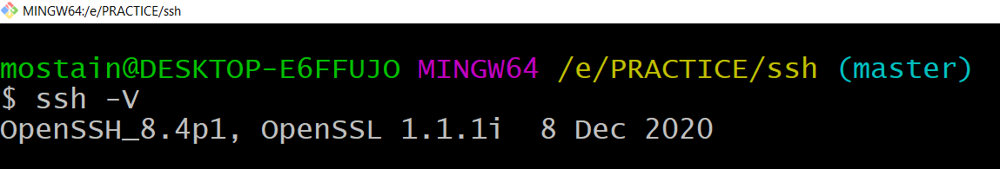
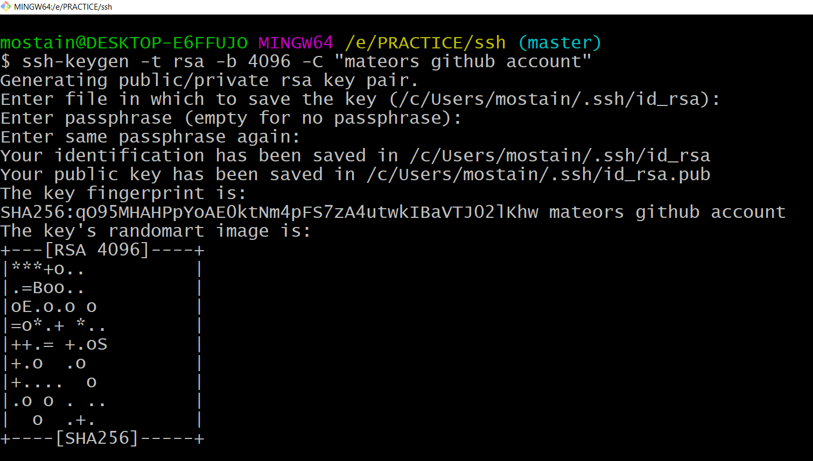
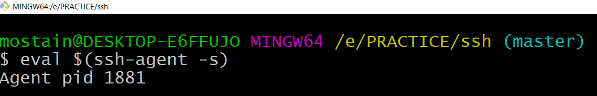
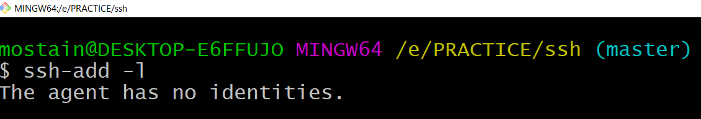
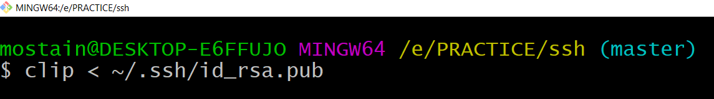
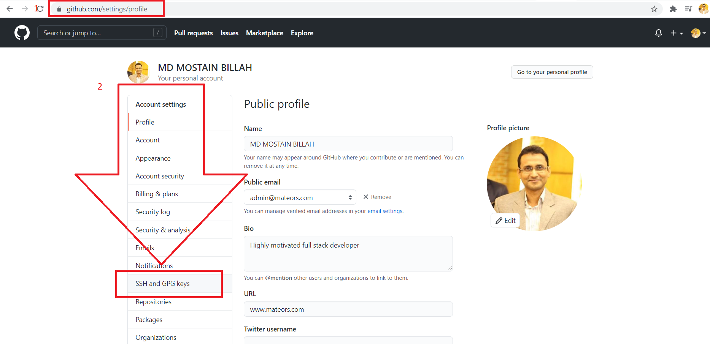
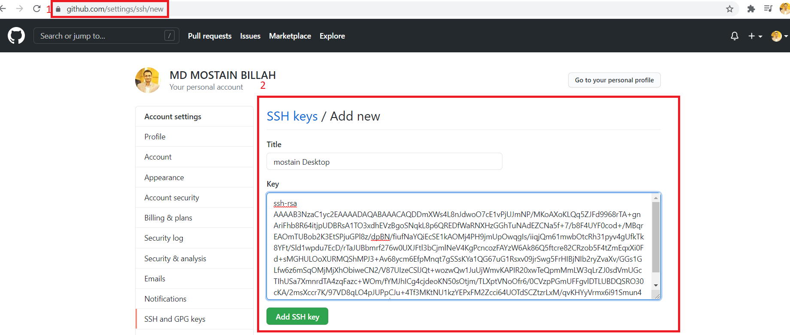
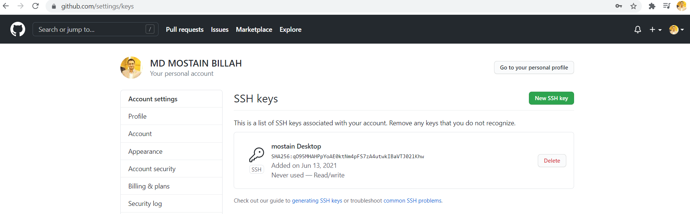
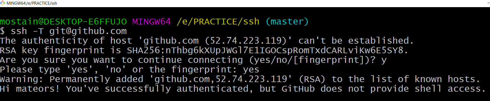

## SSH - Secure Shell
## What is SSH ?
> The Secure Shell Protocol is a cryptographic network protocol for operating network services securely over an unsecured network.

> SSH, also known as Secure Shell or Secure Socket Shell, is a network protocol that gives users, particularly system administrators, a secure way to access a computer over an unsecured network.

## Who created SSH?
Tatu Ylönen, in 1995 from Finland.

> SSH is a network protocol that gives users, particularly system administrators, a secure way to access a computer over an unsecured network.

> SSH implementation comes with scp utility for remote file transfer that utilises SSH protocol. SSH for file transfer is also utilised by other applications such as sftp and rsync which can make use of SSH to secure its network transaction.

## What is ssh key?
> Essentially, SSH keys are an authentication method used to gain access to an encrypted connection between systems and then ultimately use that connection to manage the remote system

## Check ssh version
> `ssh -V`

## SSH Key Generation
> `ssh-keygen -t rsa -b 4096 -C "mateors github account"`

> `ssh-keygen -t rsa -b 4096 -C "your@email.com"` you may use either email or comment

## What is eval?
> eval is a built-in Linux command which is used to execute arguments as a shell command.

## Start your ssh-agent
> `eval $(ssh-agent -s)`

## Check SSH Identity
> `ssh-add -l`

## Check public key
> `ls ~/.ssh`
> `cat ~/.ssh/id_rsa.pub`

## Copy the public key
> `clip < ~/.ssh/id_rsa.pub`

## Paste the clipboard into github following address
> location-> https://github.com/settings/ssh/new

## To Verify Authentication
> `ssh -T git@github.com`

# To change the passpharse
> `ssh-keygen -p`

# Delete single named private key from ssh-agent
> `ssh-add -d ~/.ssh/id_rsa`

# Remove ALL private keys from the ssh-agent
> `ssh-add -D`

> This is a test line added from the client machine

Reference:
* [Windows Installation](https://docs.microsoft.com/en-us/windows-server/administration/openssh/openssh_install_firstuse)
